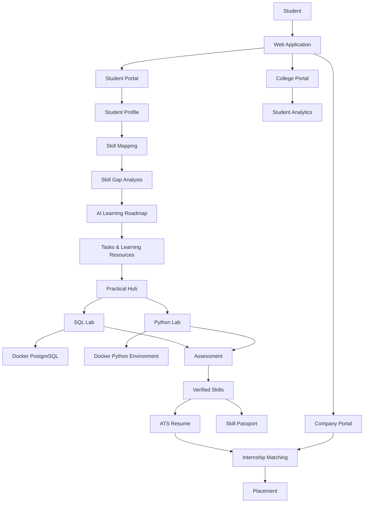

# 🎓 Academia–Industry Collaboration Portal

> Bridging the gap between **Academic Learning and Industry Requirements**

## 🚀 Overview

Academia–Industry Collaboration Portal is a platform designed to help students identify industry skill gaps, follow personalized learning roadmaps, practice technical skills in real environments, verify their skills, build ATS-friendly resumes, and connect with internship and placement opportunities.

The platform connects three major stakeholders:

- 👨🎓 Students
- 🏫 Colleges
- 🏢 Companies

---

## 🎯 Problem Statement

Students often learn theoretical concepts but face difficulty understanding:

- Which skills are actually required by industry
- Which skills they are missing
- What they should learn next
- How much time they need to become job-ready
- Where they can practice their skills
- How they can prove their skills to companies
- How to find suitable internships and placements

Our platform provides an end-to-end solution.

---

## 💡 Our Solution

```text
Student Profile
      ↓
Skill Mapping
      ↓
Skill Gap Detection
      ↓
AI Learning Roadmap
      ↓
Tasks + Learning Resources
      ↓
Practical Learning
      ↓
Assessment
      ↓
Verified Skills
      ↓
ATS Resume
      ↓
Internship Matching
      ↓
Placement
```

---

## 🏗️ System Architecture



---

## 🔄 Student Journey

### 1️⃣ Profile

Student creates a complete academic and professional profile.

### 2️⃣ Skill Mapping

The system compares student skills with industry requirements.

### 3️⃣ Skill Gap

The platform identifies missing and weak skills.

### 4️⃣ AI Roadmap

AI generates a personalized roadmap including:

* Skills to learn
* Learning sequence
* Estimated hours
* Estimated days
* Daily study plan
* Practical tasks

### 5️⃣ Learning Resources

Students receive:

* YouTube learning resources
* Topic-wise notes
* Recommended learning materials

### 6️⃣ Practical Hub

Students can practice technical skills directly through the browser.

Currently supported:

* 🗄️ SQL / PostgreSQL
* 🐍 Python

### 7️⃣ Assessment

Students complete skill-specific assessments.

### 8️⃣ Verified Skills

Successful performance generates verified skill evidence.

### 9️⃣ ATS Resume

Verified skills automatically become part of the student's ATS-friendly resume.

### 🔟 Internship Matching

Students are matched with opportunities based on:

* Skills
* Skill level
* Verified skills
* Education
* Projects
* Career goal

### 1️⃣1️⃣ Placement

The platform tracks the journey from internship to placement.

---

# 🐳 Practical Learning Environment

One of the key features is the practical learning environment.

Students do not need to install programming environments locally.

## SQL Lab

Students can:

* Browse databases
* View tables
* Write SQL queries
* Execute queries
* View real results
* Practice SQL problems
* Submit solutions

Architecture:

```text
Student Browser
      ↓
Web Application
      ↓
Backend API
      ↓
SQL Execution Service
      ↓
PostgreSQL Docker Container
```

## Python Lab

Students can:

* Write Python code
* Execute code
* View output
* Practice programming problems
* Submit solutions

Architecture:

```text
Student Browser
      ↓
Web Application
      ↓
Backend API
      ↓
Python Execution Service
      ↓
Isolated Python Docker Container
```

> Docker is used as the isolated execution environment for practical learning.

---

# 🤖 AI Career Assistant

The AI Career Assistant acts as a personalized career and learning assistant.

It considers:

* Student profile
* Skills
* Skill gaps
* Learning roadmap
* Tasks
* Assessment results
* Verified skills
* Projects
* Internship readiness

Example questions:

```text
"What should I learn today?"

"Why do I have a SQL skill gap?"

"Am I ready for a Data Analyst internship?"

"Explain SQL JOIN."

"Suggest a project for my current skills."

"How can I improve my resume?"
```

---

# 📋 Smart Task Management

The platform automatically converts the learning roadmap into actionable tasks.

Example:

```text
Today's Tasks

□ Watch SQL JOIN tutorial
□ Read SQL JOIN notes
□ Complete SQL practical
□ Take SQL assessment

Progress: 3 / 4
```

Task completion updates the student's learning progress.

---

# 🛡️ Verified Skill Passport

Skills are not simply self-declared.

Verification is based on:

```text
Learning
   ↓
Practice
   ↓
Assessment
   ↓
Verification
```

Example:

```text
SQL
✓ Verified

Assessment: 8/10
Practical: Completed
```

Companies can use this evidence when evaluating students.

---

# 📄 ATS Resume Builder

The platform automatically creates an ATS-friendly resume using:

* Student profile
* Education
* Skills
* Verified skills
* Projects
* Internships
* Certifications
* Achievements

Verified skills are automatically included.

---

# 🏫 College Portal

Colleges can monitor:

* Student progress
* Industry skill gaps
* Skill analytics
* Internship readiness
* Verified skills
* Placement statistics

---

# 🏢 Company Portal

Companies can:

* Create internship opportunities
* Define required skills
* Search students
* View verified skills
* View Skill Passport
* Shortlist candidates
* Manage applications

---

# 🛠️ Technology Stack

### Frontend

* React
* TypeScript
* Tailwind CSS

### Backend

* REST APIs
* Node.js / backend services

### Database

* PostgreSQL

### Authentication

* Mobile Number + OTP
* Role-based access control

### Practical Environment

* Docker
* Python containers
* PostgreSQL containers

### AI

* AI-powered career and learning recommendations

### Deployment

* Cloud-based web deployment
* Container-based practical execution

---

# 🔐 Security

The practical execution architecture is designed to isolate student code.

Security considerations include:

* Container isolation
* Execution time limits
* CPU limits
* Memory limits
* No host filesystem access
* No privileged containers
* API-based execution
* Authentication
* Role-based authorization
* Input validation

---

# 📊 Key Features

| Feature                | Description                         |
| ---------------------- | ----------------------------------- |
| 👤 Student Profile     | Central student information         |
| 📊 Skill Mapping       | Student vs industry requirements    |
| ⚠️ Skill Gap           | Identifies missing skills           |
| 🤖 AI Roadmap          | Personalized learning plan          |
| 💬 AI Assistant        | Personalized career support         |
| 📋 Smart Tasks         | Roadmap-based task tracking         |
| 📚 Resources           | Videos and notes                    |
| 🐳 SQL Lab             | Real PostgreSQL practice            |
| 🐍 Python Lab          | Real Python practice                |
| 📝 Assessment          | Skill evaluation                    |
| ✅ Verification         | Evidence-based skill verification   |
| 🪪 Skill Passport      | Digital verified skills             |
| 📄 ATS Resume          | One-click resume                    |
| 💼 Internship Matching | Skill-based opportunities           |
| 🏫 College Analytics   | Student & skill analytics           |
| 🏢 Company Portal      | Recruitment & internship management |
| 🎯 Placement           | End-to-end career journey           |

---

# 🏆 Smart India Hackathon (SIH)

This project is developed as part of our **Smart India Hackathon (SIH)** journey.

### SIH Team

| Role              | Name      |
| ----------------- | --------- |
| 👨💻 Team Leader | YOUR NAME |
| 👨💻 Team Member | MEMBER 2  |
| 👨💻 Team Member | MEMBER 3  |
| 👨💻 Team Member | MEMBER 4  |
| 👨💻 Team Member | MEMBER 5  |
| 👨💻 Team Member | MEMBER 6  |

> Replace the placeholders with the actual SIH team member names.

---

# 📸 Screenshots

Add your application screenshots here:

```text
docs/
├── dashboard.png
├── skill-gap.png
├── roadmap.png
├── practical-sql.png
├── practical-python.png
├── assessment.png
├── skill-passport.png
└── resume.png
```

Example:

```markdown


```

---

# 🔮 Future Scope

The platform can be expanded with:

* More programming environments
* Java / C++ / JavaScript labs
* Advanced AI mentoring
* Real company integrations
* Industry certifications
* Advanced coding assessments
* Interview simulation
* Real-time company recruitment
* Advanced college analytics
* Scalable container orchestration
* Mobile application

---

# 🎯 Vision

> **Learn → Practice → Prove → Connect → Get Hired**

Our goal is to create a bridge between **what students learn in academia and what industries actually need.**

---

## 👥 SIH Team

**Academia–Industry Collaboration Portal**

Built with ❤️ by our SIH team.
